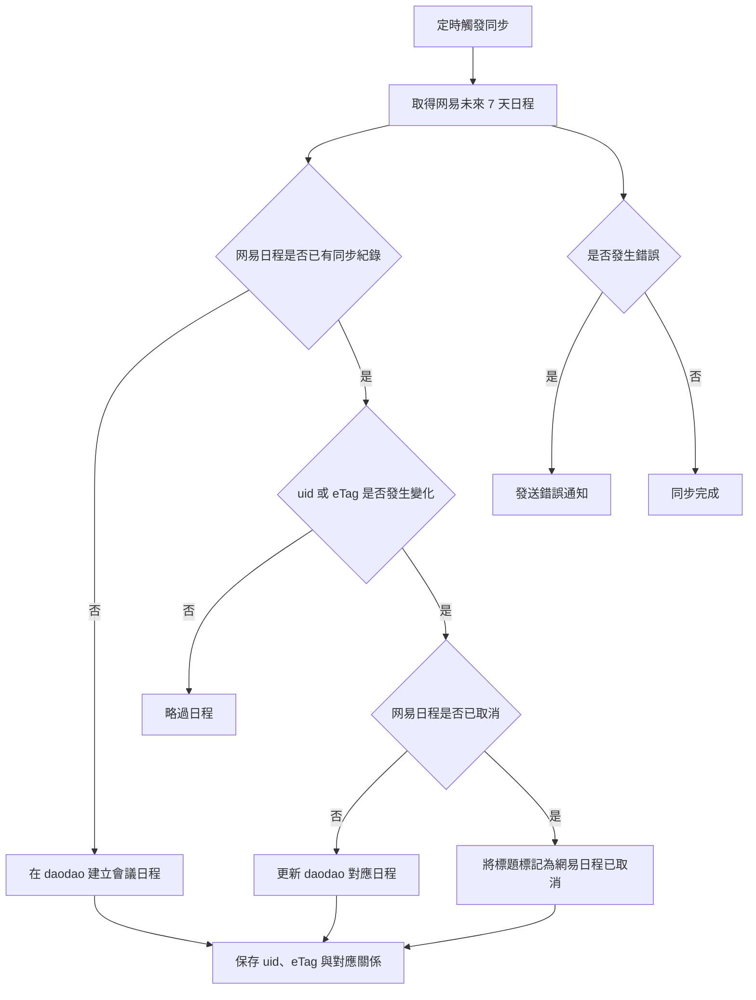

# 需求 brief：网易企業郵箱日程同步至 daodao my calendar v0.1－集中查看完整會議日程

## 1、背景（事因、客觀因素、出現的問題）

- **現況：** 使用者會收到許多來自网易企業郵箱的會議邀約，並在网易企業郵箱日程中查看。
- **目前使用的產品：** 使用者日常主要使用公司的 `daodao my calendar`，其中記錄任務與會議類型日程。
- **目前限制：** 网易企業郵箱與 `daodao my calendar` 尚未互通，使用者需要分別查看兩個日曆。
- **造成的影響：**
  - 使用者可能漏看其中一個日曆的會議。
  - 兩邊日程可能發生時間衝突，但無法及時發現。
  - 使用者需要重複維護或確認日程。
- **相關案例：** 网易企業郵箱中已有會議日程，但 `daodao my calendar` 未同步顯示。

## 2、目的（想要實現的效果、考核指標）

1. 將网易企業郵箱未來 7 天的會議日程，自動同步至 `daodao my calendar`。
2. 讓使用者主要透過 `daodao my calendar` 查看完整會議安排，減少跨系統查看造成的遺漏與衝突。
3. 當网易日程發生更新或取消時，及時反映到 `daodao my calendar`。

### 考核指標

| 指標 | 目前值 | 目標值 | 衡量方式 |
|---|---:|---:|---|
| 网易日程同步覆蓋率 | 待確認 | ≥ 99% | 比對网易企業郵箱與同步結果 |
| 日程更新同步成功率 | 待確認 | ≥ 99% | 比對 `eTag` 變化與 daodao 更新結果 |
| 取消日程同步成功率 | 待確認 | ≥ 99% | 比對网易取消狀態與標題更新結果 |
| 同步延遲 | 無自動同步 | ≤ 2 小時 | 比對來源變更時間與同步完成時間 |
| 重複建立日程數 | 待確認 | 0 | 以來源 `uid` 統計重複紀錄 |
| 同步失敗通知率 | 無 | 100% | 比對錯誤事件與通知紀錄 |

## 3、用戶故事

1. As a 使用者, I want to 將网易企業郵箱未來 7 天的會議日程同步到 `daodao my calendar`, so that 我只需要查看一個日曆即可掌握完整會議安排。
2. As a 使用者, I want to 在网易日程更新後同步更新 daodao 中對應的會議, so that 我不會依照過期的會議時間或內容參與會議。
3. As a 使用者, I want to 在网易日程取消後看到「網易日程已取消」標記, so that 我能知道原本的會議已取消，而不是誤以為同步失敗。
4. As a 使用者, I want to 在同步失敗或授權失效時收到通知, so that 我能及時處理同步問題。

## 4、產品結構

- **所屬產品：** `daodao my calendar`
- **所屬模組：** 會議日程／外部日曆同步
- **新增／調整的功能：**
  - 网易企業郵箱 CalDAV 日程讀取。
  - 网易日程同步至 `daodao my calendar`。
  - 日程更新同步。
  - 日程取消標記同步。
  - 定時同步。
  - 同步錯誤與授權失效通知。
- **與既有功能的關係：**
  - 使用目前的 `netease-caldav-skill` 讀取网易日程。
  - 使用既有的 `daodao my calendar` 建立日程接口。
- **範圍限制：**
  - 只做网易企業郵箱到 `daodao my calendar` 的單向同步。
  - 不查詢或比對 `daodao my calendar` 中已有的會議。
  - 不處理從 daodao 回寫网易企業郵箱的變更。

## 5、核心流程描述

### 流程參與者／系統

- 使用者
- `netease-caldav-skill`
- 网易企業郵箱 CalDAV
- `daodao my calendar` API
- 定時執行機制
- 錯誤通知機制

### Mermaid 流程圖

### 文字流程

1. 定時機制每 2 小時觸發一次同步。
2. `netease-caldav-skill` 查詢网易企業郵箱未來 7 天的日程。
3. 系統使用网易日程的 `uid` 判斷是否曾經同步過。
4. 對於未同步過的日程，在 `daodao my calendar` 建立「會議」類型日程。
5. 對於已同步日程，使用 `eTag` 判斷內容是否發生變化。
6. 若日程內容有變化，更新 daodao 中對應的日程。
7. 若网易日程被取消，將 daodao 中對應日程的標題標記為「網易日程已取消」。
8. 不查詢或比對 daodao 內其他既有會議，直接依同步紀錄建立或更新對應日程。
9. 若同步失敗、授權失效或 daodao API 呼叫失敗，發送錯誤通知。
10. 同步成功後保存來源 `uid`、`eTag`、來源 URL 與 daodao 日程對應關係，避免同一來源日程被重複建立。

## 6、名詞解釋

| 名詞 | 定義 |
|---|---|
| `netease-caldav-skill` | 用於連接网易企業郵箱 CalDAV 並讀取日程的 OpenClaw skill。 |
| 网易企業郵箱 | 使用者收到會議邀約與保存原始日程的郵箱系統。 |
| `daodao my calendar` | 公司使用的日曆系統，用於集中查看任務與會議。 |
| CalDAV | 用於存取日曆資料的標準協議。 |
| `uid` | 网易日程的唯一識別碼，用於判斷是否為同一個來源日程。 |
| `eTag` | 网易日程的版本識別碼，用於判斷日程內容是否更新。 |
| 同步窗口 | 每次同步時查詢的日期範圍，目前設定為未來 7 天。 |
| 取消標記 | 將 daodao 日程標題改為「網易日程已取消」的處理方式。 |

## 7、待確認事項

- `daodao my calendar` 建立、更新日程 API 的完整欄位與驗證方式。
- daodao 中「會議」類型的正式欄位值。
- 网易日程取消狀態的實際判斷方式，例如刪除資源、`STATUS:CANCELLED` 或其他欄位。
- 「網易日程已取消」是完整取代原標題，還是使用「網易日程已取消｜原標題」格式。
- daodao 日程對應紀錄的保存位置與生命週期。
- 同步錯誤通知渠道，例如 OpenClaw 訊息、Email、Slack 或其他方式。
- 同步時區是否固定使用使用者設定的 `CALDAV_TIMEZONE`。
- 每 2 小時同步一次是否能接受最長約 2 小時的同步延遲。
- 日程從「未來 7 天」移出範圍後，是否仍需要持續追蹤其更新或取消。
- 如果网易日程再次恢復或重新建立，是否要解除「網易日程已取消」標記。
